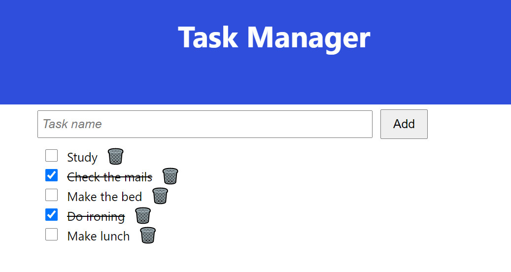

# Task Manager

Task Manager is an application for managing tasks or todos developed with Dropwizard (Java framework) for the backend
and React for the frontend.

## Running

### Using built images

`$ docker-compose up -d` will deploy following services:
- MySQL database with docker image ->https://hub.docker.com/repository/docker/atascg01/task-manager-database/general
- Dropwizard backend application with docker image -> https://hub.docker.com/repository/docker/atascg01/task-manager
- React frontend application with docker image -> https://hub.docker.com/repository/docker/atascg01/task-manager-frontend

### Building your own images

All 3 images can be built your own way by running the command:
`$ docker build -t container_name .`
located in the Dockerfile of each image.

If you want to use your own image, configure it also in `docker.compose.yml` by replacing `db`, `frontend` and/or `backend`service's
`images` from `atascg01/task-manager-database:latest` to your own images.

For instance, you may want to build your own image configuring the BASE_URL, which is currently pointing to the oracle instance
located under frontend/src/config.json

## Live server
There is a live server running in an Oracle-Linux-8.5 available here:
http://129.151.246.234:3001/

## Testing report

Task manager uses Jacoco for generating a test report by executing jacoco maven goal: report

## Packaging

`mvn package` generates a `task-manager-1.0-SNAPSH.jar` that can be executed with
command `$ java -jar /path/to/jar server application.yml`.

There are some environment variables that the application needs, such as `DATABASE_USERNAME` and `DATABASE_PASSWORD`.

