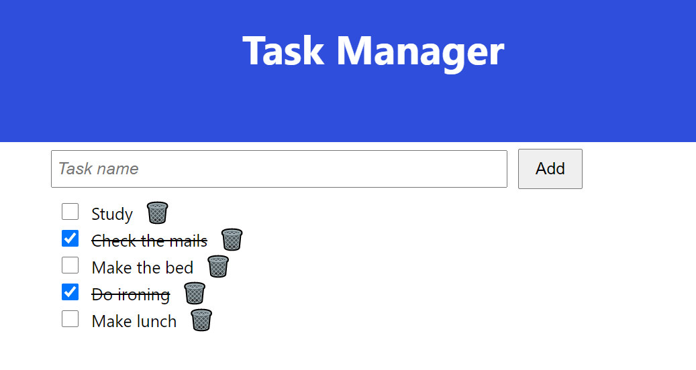

# Task Manager

Task Manager is an application for managing tasks or todos developed with Dropwizard (Java framework) for the backend
and React for the frontend.

## Backend

Backend source code is located under `src/main/java`.

## Frontend

Frontend application source code is located under `src/main/frontend` directory

## Packaging

`mvn package` generates a `task-manager-1.0-SNAPSH.jar` that can be executed with
command `$ java -jar /path/to/jar server application.yml`.

There are some environment variables that the application needs, such as `DATABASE_USERNAME` and `DATABASE_PASSWORD`.
